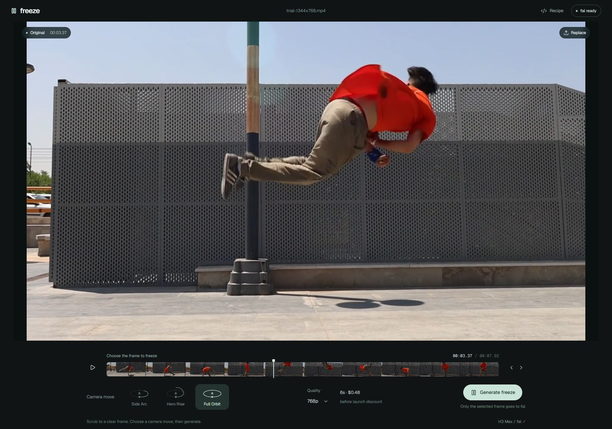

# Freeze

Turn one frame of a video into a camera orbit with [MiniMax H3 Max Multi Angle on fal](https://fal.ai/models/minimax/h3-max/multi-angle/image-to-video), then resume the original action.



```text
Original up to the selected frame → generated camera move → rest of the original
```

## Run locally

Requires Node.js 22.13+ and npm. Install **FFmpeg and ffprobe** on your PATH for native local export.

```bash
git clone https://github.com/blendi-remade/freeze.git
cd freeze
npm ci
```

Create a `.env.local` file in the project root:

```dotenv
FAL_KEY=your_fal_key
```

Then start the app:

```bash
npm run dev
```

Open the local URL printed in the terminal. Alternatively, leave the key file unset and use **Connect fal** to enter a key for the current tab. `.dev.vars*` and `.env*` files are ignored by Git; never commit your key.

## Make an edit

1. Open or drop a video. H.264 MP4 is the most predictable format. Clips can be 1–60 seconds and up to 150 MB.
2. Scrub to a sharp frame at the moment you want to freeze.
3. Choose a camera move from the illustrated dropdown, resolution, AI clip speed (1×–2×), and whether to trim the last second of the AI clip. Then select **Generate freeze**.
4. The app generates the camera move and automatically assembles the complete video. Download the finished MP4.

**Rebuild full video** reuses the existing generation without another model call. Keep the tab open until you download your result; projects are not saved across refreshes.

## Camera controls

| Preset | Path | Requested duration |
| --- | --- | --- |
| Full Orbit (default) | 0° → 360° azimuth, level elevation | 6 seconds |
| Side Arc | 0° → 65° azimuth, 0° → 8° elevation | 5 seconds |
| Hero Rise | 0° → 35° azimuth, 0° → 30° elevation | 5 seconds |
| Orbit Left | 0° → −360° azimuth, level elevation | 6 seconds |
| Arc Return | 0° → 45° → 0° azimuth, level elevation | 5 seconds |
| Rise Return | 0° → 25° → 0° elevation, fixed azimuth | 5 seconds |
| Left Return | 0° → −45° → 0° azimuth | 5 seconds |
| Wide Return | 0° → 90° → 0° azimuth | 5 seconds |
| Dip Return | 0° → −20° → 0° elevation | 5 seconds |
| High Return | 45° right and 25° up, then return | 5 seconds |
| Low Return | 45° left and 20° down, then return | 5 seconds |
| Side to Side | 30° left → 30° right → opening pose | 5 seconds |
| High Orbit | Full right orbit with a 25° elevation peak | 6 seconds |
| High Orbit Left | Full left orbit with a 25° elevation peak | 6 seconds |
| Left Arc | 0° → −65° azimuth, 0° → 8° elevation | 5 seconds |
| Low Reveal | 0° → 40° azimuth, 0° → −20° elevation | 5 seconds |

Full Orbit and Orbit Left follow the fal playground's **Orbit 360° right/left** presets: eight 45° steps at constant elevation and distance. They reach ±360° at normalized time 0.833333, then hold through time 1. Signed full turns are preserved; the endpoint angle must not be reset to 0°, which would command a reverse turn. The playground's spiral, half-orbit, crane and swing presets do not return to their starting pose.

Custom paths use the [camera keyframe API](https://fal.ai/models/minimax/h3-max/multi-angle/image-to-video/api). Twelve presets return to their opening camera pose and are marked **Returns to start**. All presets use a scene-independent freeze prompt, constant camera distance, balanced prompt expansion and no fixed seed. Returning presets also request the original framing at the end. The **Recipe** panel shows the exact payload; edit `lib/recipe.ts` to adjust it.

AI clip speed and optional end trimming affect only the inserted clip. Trimming removes one second before speed adjustment. Original footage keeps its timing; camera audio follows the chosen speed without changing pitch. These options are saved with the generation and reused for export retries. They do not change model duration or generation cost.

## How it works

- The browser extracts a JPEG at your selected timestamp. Only that frame is sent to fal for generation.
- Server routes submit the request and poll the fal queue. Server-configured keys are never returned to the browser. Manually entered keys live in tab memory and are passed to the relay.
- In local development, native FFmpeg assembles the source prefix, generated clip, and source tail. Temporary assembly files are removed afterward.
- The generated clip sets the output dimensions. The original is resized to match without cropping or padding, which can slightly change its proportions.
- The generated clip, with any selected trim and speed applied, cuts directly to the source tail. There is no exit blend, crossfade or optical-flow alignment.
- Output is H.264 MP4 at 30 fps. Audio from each segment is retained when available, with silence substituted where needed.
- When native local export is unavailable, the app falls back to browser FFmpeg WebAssembly. The approximately 32 MB engine loads on demand; browser export can be slower and use substantial memory.

Built with React, TypeScript, Next.js App Router, and Node.js API routes.

## What to expect

This is an experimental demo. We have tested real backflip footage, but results vary with the frame and camera path. H3 may animate subjects, invent unseen geometry, or change framing and lighting. Matching start/end camera poses does not guarantee pixel-identical frames or a seamless cut. The new return paths have payload and encoder tests, not a real-footage quality benchmark.

Use a short SDR clip and a sharp freeze frame for initial tests. HDR tone mapping, automatic color matching, subject tracking, and exact variable-frame-rate stepping are not implemented. Timeline stepping uses 1/30-second increments.

Generation is billed to your fal account. Check [current endpoint pricing](https://fal.ai/models/minimax/h3-max/multi-angle/image-to-video) before running a batch. The UI displays standard-price estimates; promotions and actual billing may differ. If polling times out, check your fal dashboard before submitting another request.

## Development checks

```bash
npm run typecheck
npm run lint
npm test
npm run build
```

Tests require native FFmpeg and ffprobe. They check timeline duration, output dimensions and audio for several insertion points, including mismatched source/generated aspect ratios, and exercise the shipped WebAssembly encoder. See [the footage test plan](docs/testing.md) for manual checks.

`npm run test:camera` runs without native FFmpeg. It checks all preset payloads and decodes WebAssembly exports to verify speed, optional end trimming, audio timing, and direct cuts to the unchanged source footage.

## Production configuration

Use Node.js 22.x with `npm ci`, `npm run build`, and `npm start`. Production uses browser WebAssembly for video assembly. Configure a private server-side `APP_PASSWORD` to enable the workspace sign-in gate (username `freeze`); requests fail closed if it is missing. Set `FAL_KEY` server-side for shared generation billing, or use **Connect fal** for a key that stays in the current tab's memory. Never commit credentials or expose them through public environment variables.

## License

Application code is MIT. The H3 Max endpoint is a separate paid service with its own terms. The screenshot shows the editor with sample footage; that footage is not included in the code license or bundled as a video. The empty-state illustration is AI-generated artwork, not a model result.

`@ffmpeg/ffmpeg` and `@ffmpeg/util` are MIT; the bundled `@ffmpeg/core` is GPL-2.0-or-later. See [third-party notices](THIRD_PARTY_NOTICES.md) and preserve the applicable notices and source obligations when redistributing it.
